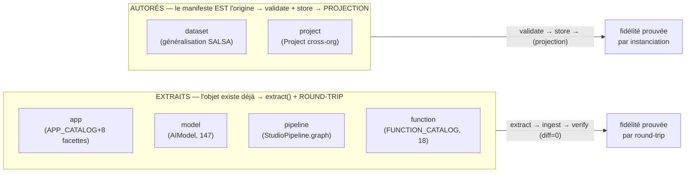
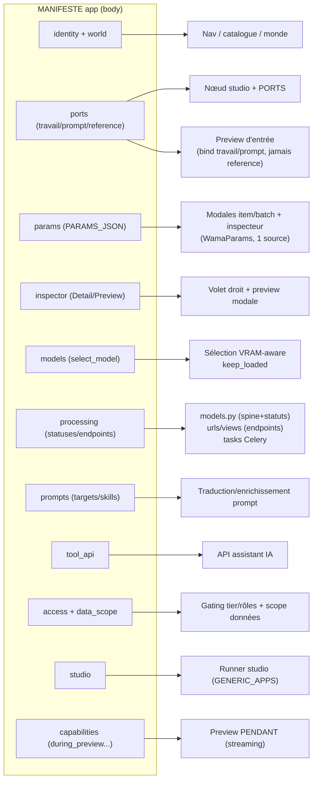
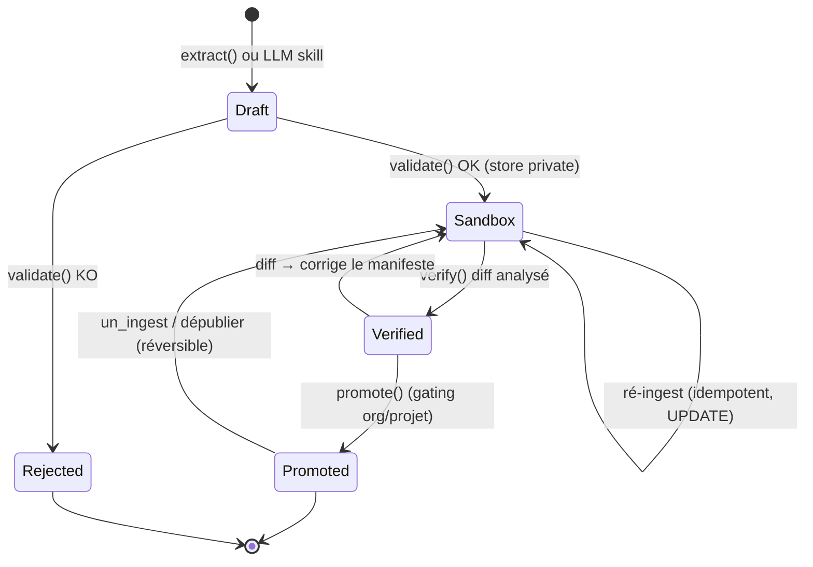
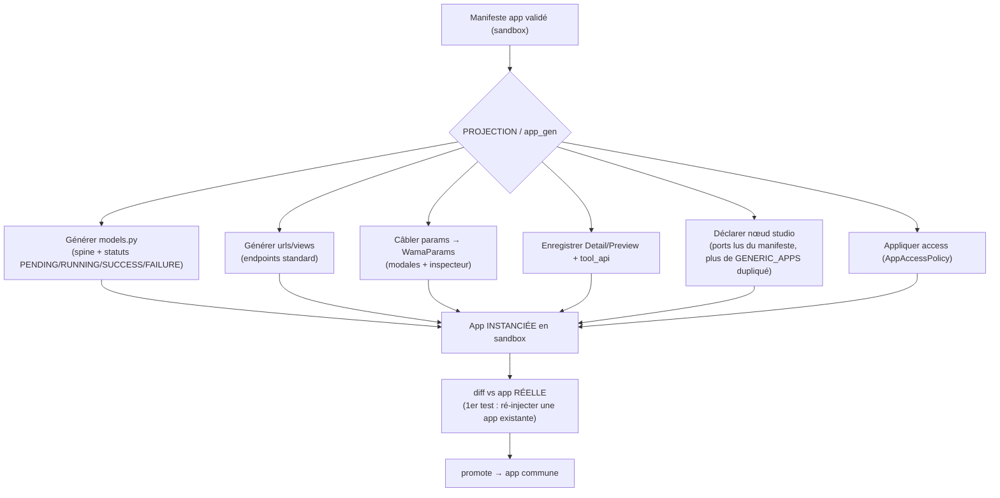

# WAMA — Schéma fonctionnel : Manifestes → Ingest → Génération d'app → Mécanismes UI

> **But** : voir clair sur la chaîne complète AVANT d'attaquer l'auto-génération d'application.
> Complète `WAMA_MANIFEST_SPEC.md` (formalisme) avec les FLUX. État au 2026-07-21 : socle des 6 kinds
> **fait et testé** ; la **projection / génération d'app** = le prochain (et gros) chantier, en pointillés.
> Légende des flux : **trait plein = existe & testé** · **pointillés = à construire (app_gen)**.

---

## 1. Vue d'ensemble — le tunnel (deux extrémités qui se rejoignent)

```mermaid
flowchart TD
    subgraph SRC["SOURCES du manifeste"]
        LIB["Librairie / dossier projet<br/>(données brutes, SALSA...)"]
        CODE["Code + DB existants<br/>(APP_CATALOG, AIModel,<br/>StudioPipeline, Project...)"]
    end

    LLM["Manifest skill (LLM local)<br/>wama-dev-ai : infère un brouillon"]
    EXT["extract(kind, key)<br/>LIT les registres"]

    LIB -->|autoré| LLM
    CODE -->|extrait| EXT
    LLM --> MAN
    EXT --> MAN

    MAN["MANIFESTE<br/>enveloppe + body(kind)<br/><i>source autoritaire</i>"]

    MAN --> ING

    subgraph ING["MOTEUR D'INGEST (fait)"]
        direction TB
        V["validate()<br/>enveloppe + body(kind)"]
        SB["store SANDBOX<br/>visibility=private"]
        VF["verify()<br/>diff manifeste ↔ courant"]
        PR["promote()<br/>private → project/unit/public"]
        V --> SB --> VF --> PR
    end

    ING --> STORE["Manifest store<br/>(common.Manifest, DB)"]

    STORE -.->|PROJECTION (app_gen, à venir)| REG
    subgraph REG["REGISTRES FONCTIONNELS (inchangés)"]
        R1["APP_CATALOG / GENERIC_APPS"]
        R2["params.py · Detail/PreviewRegistry"]
        R3["PROMPT_TARGETS · tool_api"]
        R4["AppAccessPolicy · model_selector"]
    end

    REG --> UI["MÉCANISMES UI + EXÉCUTION"]
    UI --> APP["Application qui tourne"]

    STORE -.->|un_ingest (réversible)| STORE
    MAN -.->|ré-ingest = UPDATE idempotent| ING
```

**Lecture** : aujourd'hui le flux VA `code → extract → manifeste → store` (on éprouve la lecture).
La **projection** (`store → registres`) est le sens inverse, en pointillés : c'est elle qui *génère*
l'app. Tant qu'elle n'existe pas, `project=None` et les registres restent la source — **zéro overlap**.

---

## 2. Les 6 kinds — deux familles, deux tests de fidélité



> `function` chevauche : `pure`/`app` = extraits du catalogue code ; `user` (UserFunction) = autoré en DB.
> `project` a un modèle DB donc s'EXTRAIT aussi, mais sa raison d'être reste l'autorat (créé par l'humain).

---

## 3. Le kind `app` — chaque facette alimente un mécanisme (la carte de l'app_gen)

> C'est LA carte à tenir pour l'auto-génération : que **génère** chaque facette du manifeste `app`.
> À gauche le manifeste (source unique), à droite le mécanisme WAMA existant qu'il pilotera.



**Round-trip = test de cette carte** : régénérer une app depuis son manifeste doit reproduire
models.py + urls/views + modales + inspecteur + nœud studio + gating + câblage prompts/tool_api.
Les écarts révèlent trous du schéma ET mécanismes non généralisés (aujourd'hui : `modes`=5 apps,
`imager`=détail sans preview, apps lab hors APP_CATALOG).

---

## 4. Cycle de vie d'un manifeste dans l'ingest (machine à états)



Propriétés garanties (testées) : **idempotent** (kind+key), **transactionnel** (@atomic),
**réversible** (un_ingest), **traçable** (source + `_manifest_key` sur dérivés à venir).

---

## 5. Où se branche l'auto-génération d'application (prochain chantier)



**Discipline (non négociable)** : la projection est **idempotente / transactionnelle / réversible** ;
les registres deviennent des **projections** re-synchronisables (`verify` réconcilie) ; on **converge**
`APP_CATALOG ⟷ GENERIC_APPS` en un seul kind `app` au lieu d'ajouter un 6e endroit.

---

## 5bis. Résultats du 1er round-trip / dry-run (2026-07-21, `496b85d`)

Étape 1 de la projection = **dry-run sans code-gen** (`wama/common/manifests/projection.py`).
Deux sorties, toutes deux fidèles au code réel :

**A. Projetabilité par facette** — sur les 12 facettes du kind `app`, **une seule est projetable au
RUNTIME** (`access` → `AppAccessPolicy`, DB) ; les **11 autres sont du CODE-GEN** (APP_CATALOG, params.py,
models.py/urls, GENERIC_APPS…). Facettes MANQUANTES fréquentes (trou de schéma OU app non concernée — à
lever au cas par cas) : `modes` (absent hors 5 apps), `prompts` (apps non génératives : normal), `models`
(apps sans catalogue `<APP>_MODELS`).

**B. Round-trip redondance `ports (app_registry)` ⟷ `GENERIC_APPS`** — ⚠ **CORRIGÉ 2026-07-22 (Fabien).**
La 1re lecture parlait de « divergences réelles » ; c'était une ERREUR d'analyse (lecture de la SURFACE des
registres sans tracer le CHAÎNAGE d'exécution). Réalité :

- **Le typage de SORTIE n'est PAS un trou.** Il est chaîné : `output_types` (dans **APP_CATALOG**) → domaine →
  `wama/common/utils/output_formats.py` (`output_format_params_for_app`) → réutilise `CONVERTER_OUTPUT_FORMATS`
  (`converter.format_router`) = **source unique déjà maintenue**. Les apps early-binding injectent les Param
  `output_format`/`output_quality` ; le converter fait la conversion. Le `output_type` de GENERIC_APPS est
  juste la sortie déclarée du NŒUD studio (câblage du graphe), un concern DISTINCT. → le manifeste DÉCRIT la
  capacité de conversion (early/late binding), il ne « manque » rien.
- **Les écarts d'ENTRÉE sont majoritairement LÉGITIMES ou de l'incomplétude, PAS de la dérive** :
  | app | lecture 1re (fausse) | réalité |
  |---|---|---|
  | avatarizer | « image en trop » | image = image de **RÉFÉRENCE** pour générer l'avatar → légitime ; GENERIC_APPS sous-décrit |
  | converter | « archive divergent » | converter **pas encore dans le studio** (studio en dev) → incomplétude, pas dérive |
  | enhancer | « audio en trop » | enhancer a **2 domaines** (image/video ET audio) → légitime ; GENERIC_APPS omet audio |
  | imager | « divergent » | ports plus riche (accepte une image en édition) ; studio simplifie en prompt-primary → légitime |
  | describer | — | **seul vrai TODO** : ajouter `document` aux ports describer |

**Conclusion CORRIGÉE** : `GENERIC_APPS` est une **VUE simplifiée (souvent lossy)** d'`app_registry` pour le
runner studio ; `app_registry` (+ briques communes) est la source RICHE. La convergence n'est donc PAS « choisir
un gagnant entre deux sources qui se contredisent » mais : **faire de GENERIC_APPS une PROJECTION calculée depuis
app_registry** (préserver le riche, régénérer le simplifié), en gardant les champs de CÂBLAGE runner que
app_registry n'a pas (`params_module/attr`, `input_kwarg`, `fixed_kwargs`, `auto_start` — pas de la redondance).
Seul vrai correctif de données : `document` aux ports describer. **Leçon : tracer le chaînage d'exécution, pas
la surface des registres.**

---

## 6. Points de vigilance connus (à traiter dans/avant l'app_gen)

- **`studio_node_ports` = accesseur unique de ports** partagé preview↔manifeste : un seul point de
  bascule quand la projection inverse le sens (cf. spec F2, contrat de jonction).
- **Redondance APP_CATALOG ⟷ GENERIC_APPS** : le typage E/S est saisi 2× à la main → la fusionner.
- **Apps lab** (`cam_analyzer`, `face_analyzer`) absentes d'APP_CATALOG → à réconcilier.
- **Déclaratif, pas runtime** : exclure du manifeste l'état volatile (modèle chargé, x/y canvas...).
- **Langue** : manifeste en EN canonique → registre i18n central (pas de traduction embarquée).
