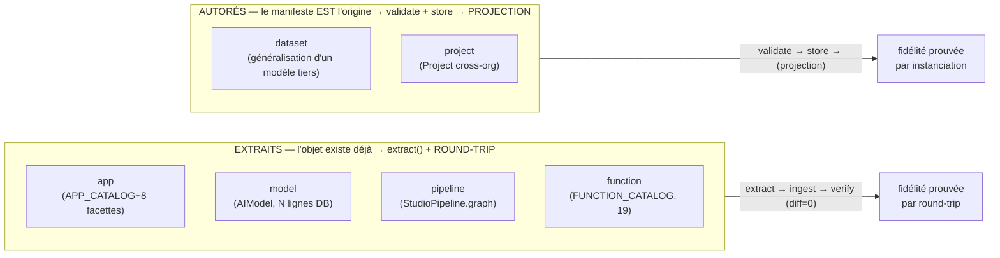
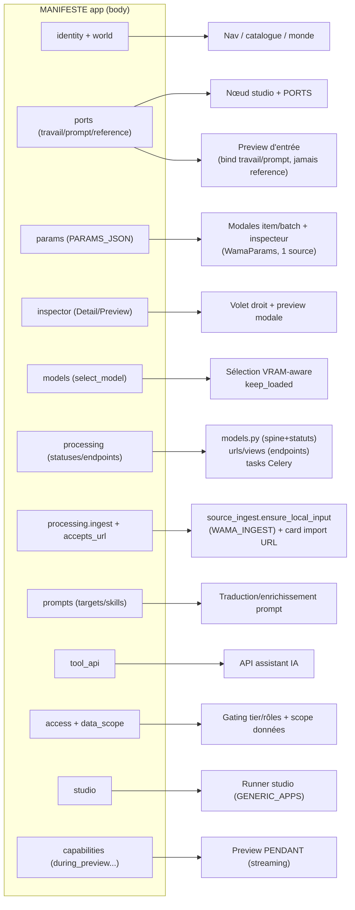
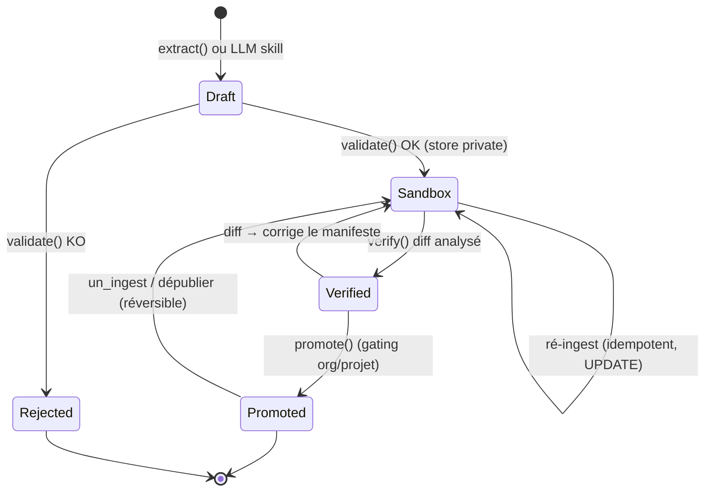
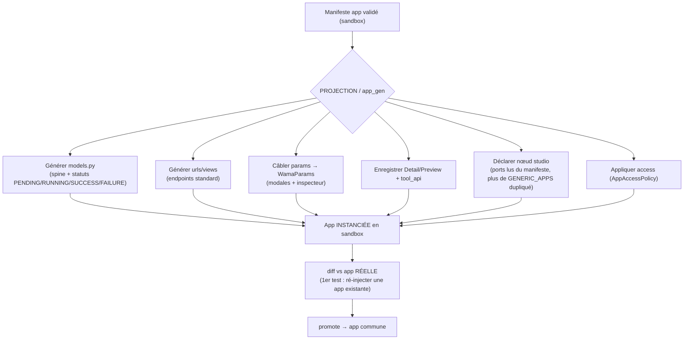

# WAMA — Schéma fonctionnel : Manifestes → Ingest → Génération d'app → Mécanismes UI

> **But** : voir clair sur la chaîne complète AVANT d'attaquer l'auto-génération d'application.
> Complète `WAMA_MANIFEST_SPEC.md` (formalisme) avec les FLUX. État au **2026-08-12 (soir,
> MARCHE A CLOSE)** : socle des **7 kinds** fait et testé ; **write-back réel sur 4 kinds** —
> `app` (**10 facettes écrites** : `access` DB + `identity`/`ports`/`capabilities`/`studio`/
> `modes`/`prompts`/`params`/`inspector`/`tool_api` en CODE via le moteur commun d'écriture
> marquée, §6quater), `library` (le registre `Library` NAÎT de la projection), `model` (champs
> déclaratifs `license`/`platform_ref`) et `function` (binding `user` → `UserFunction`, tag
> `_manifest-gen`) ; côté `app`, restent `models` (model_config) et `processing` en projection
> PARTIELLE ASSUMÉE (urls comparable ; tasks A2b et models.py A5 en CREATE-ONLY) — les corps
> et champs de résultat = marche B.
> Légende des flux : **trait plein = existe & testé** · **pointillés = à construire (app_gen)**.

---

## 1. Vue d'ensemble — le tunnel (deux extrémités qui se rejoignent)

```mermaid
flowchart TD
    subgraph SRC["SOURCES du manifeste"]
        LIB["Librairie / dossier projet<br/>(données brutes, toolbox tierce...)"]
        CODE["Code + DB existants<br/>(APP_CATALOG, AIModel,<br/>StudioPipeline, Project...)"]
    end

    LLM["Manifest skill (LLM local)<br/>wama-dev-ai : infère un brouillon"]
    EXT["extract(kind, key)<br/>LIT les registres"]

    LIB -->|autoré| LLM
    CODE -->|extrait| EXT
    LLM --> MAN
    EXT --> MAN

    MAN["MANIFESTE<br/>enveloppe + body(kind)<br/><i>source autoritaire</i>"]

    MAN --> ING

    subgraph ING["MOTEUR D'INGEST (fait)"]
        direction TB
        V["validate()<br/>enveloppe + body(kind)"]
        SB["store SANDBOX<br/>visibility=private"]
        VF["verify()<br/>diff manifeste ↔ courant"]
        PR["promote()<br/>private → project/unit/public"]
        V --> SB --> VF --> PR
    end

    ING --> STORE["Manifest store<br/>(common.Manifest, DB)"]

    STORE -->|PROJECTION 10 facettes ✅ (access DB + 9 code, moteur marqué, apply=False par défaut)| REG
    STORE -->|GABARITS codegen/ ✅ A1→A5 : urls.py régénérable, tasks.py mince + models.py CREATE-ONLY, apps.py, triade TRIAD_SPECS| REG
    STORE -.->|reste : model_config (facette models) + corps/champs de résultat (marche B)| REG
    subgraph REG["REGISTRES & DÉCLARATIONS (la JOINTURE — inchangés côté consommation)"]
        R1["APP_CATALOG / GENERIC_APPS / APP_MODES"]
        R2["params.py · urls.py · spec Detail/PreviewRegistry"]
        R3["PROMPT_TARGETS · TOOL_REGISTRY"]
        R4["AppAccessPolicy · AIModel/model_selector"]
    end

    REG --> UI["MÉCANISMES UI + EXÉCUTION<br/>(briques common : WamaDetails, WamaParams,<br/>WamaModes, studio, wama-app-base…)"]
    UI --> APP["Application qui tourne"]

    JUGE["HARNAIS app_regen_check (marche C)<br/>strip → apply → 3 axes"] -.->|juge chaque incrément| REG

    STORE -.->|un_ingest (réversible)| STORE
    MAN -.->|ré-ingest = UPDATE idempotent| ING
```

**Lecture — l'INVARIANT de la jointure (c'est lui qui fait que les deux constructions
s'imbriquent)** : **rien ne lit jamais le manifeste au runtime** (propriété de sûreté SPEC
§2.1). Le tunnel de génération ÉCRIT les registres/déclarations ; les briques d'UI communes
LISENT les registres — deux mondes, **un seul point de contact**. Conséquence vérifiable :
une app régénérée est indistinguable pour le front (prouvé au harnais : converter et reader,
strip complet → smoke/grille identiques ; parité du volet droit sur 10 items réels, A3a).
La table « qui déclare, qui tire » côté UI vit dans **`WAMA_APP_GENERATION_ROUTE.md §1`**
(l'autre côté du tunnel) — ce §-ci est le domicile UNIQUE du flux manifeste→registres.

État courant (2026-08-12 soir, marche A close) : extract 12 facettes ; projection = 10
facettes registres/fichiers (`PROJECTED_FACETS`, `tool_api` = entrée-valeur `TRIAD_SPECS`
depuis A4) + `processing` PARTIEL ASSUMÉ (urls.py régénérable ; tasks.py mince A2b et
models.py A5 en CREATE-ONLY — gabarits `common/manifests/codegen/`) ; reste `models`
(model_config) ; corps de backends et champs de résultat = marche B. Tout apply reste
un geste explicite (`apply=False` par défaut), jugé par le harnais C.

---

## 2. Les 7 kinds — deux familles, deux tests de fidélité


```mermaid
flowchart LR
    subgraph EX["EXTRAITS — l'objet existe déjà → extract() + ROUND-TRIP"]
        A["app<br/>(APP_CATALOG+8 facettes)"]
        M["model<br/>(AIModel, N lignes DB)"]
        P["pipeline<br/>(StudioPipeline.graph)"]
        F["function<br/>(FUNCTION_CATALOG, 19)"]
    end
    subgraph AU["AUTORÉS — le manifeste EST l'origine → validate + store → PROJECTION"]
        D["dataset<br/>(généralisation d'un modèle tiers)"]
        PJ["project<br/>(Project cross-org)"]
    end

    EX -->|"extract → ingest → verify (diff=0)"| OKX["fidélité prouvée<br/>par round-trip"]
    AU -->|"validate → store → (projection)"| OKA["fidélité prouvée<br/>par instanciation"]
```

> `function` chevauche : `pure`/`app` = extraits du catalogue code ; `user` (UserFunction) = autoré en DB.
> `project` a un modèle DB donc s'EXTRAIT aussi, mais sa raison d'être reste l'autorat (créé par l'humain).

---

## 3. Le kind `app` — chaque facette alimente un mécanisme (la carte de l'app_gen)

> C'est LA carte à tenir pour l'auto-génération : que **génère** chaque facette du manifeste `app`.
> À gauche le manifeste (source unique), à droite le mécanisme WAMA existant qu'il pilotera.


```mermaid
flowchart LR
    subgraph MAN["MANIFESTE app (body)"]
        f1["identity + world"]
        f2["ports (travail/prompt/reference)"]
        f3["params (PARAMS_JSON)"]
        f3b["inspector (Detail/Preview)"]
        f4["models (select_model)"]
        f5["processing (statuses/endpoints)"]
        f5b["processing.ingest + accepts_url"]
        f6["prompts (targets/skills)"]
        f6b["tool_api"]
        f7["access + data_scope"]
        f8["studio"]
        f2c["capabilities (during_preview...)"]
    end

    f1 --> u1["Nav / catalogue / monde"]
    f2 --> u2["Nœud studio + PORTS"]
    f2 --> u2b["Preview d'entrée<br/>(bind travail/prompt, jamais reference)"]
    f2c --> u2c["Preview PENDANT (streaming)"]
    f3 --> u3["Modales item/batch + inspecteur<br/>(WamaParams, 1 source)"]
    f3b --> u3b["Volet droit + preview modale"]
    f4 --> u4["Sélection VRAM-aware<br/>keep_loaded"]
    f5 --> u5["models.py (spine+statuts)<br/>urls/views (endpoints)<br/>tasks Celery"]
    f5b --> u5b["source_ingest.ensure_local_input<br/>(WAMA_INGEST) + card import URL"]
    f6 --> u6["Traduction/enrichissement prompt"]
    f6b --> u6b["API assistant IA"]
    f7 --> u7["Gating tier/rôles + scope données"]
    f8 --> u8["Runner studio (GENERIC_APPS)"]
```

**Round-trip = test de cette carte** : régénérer une app depuis son manifeste doit reproduire
models.py + urls/views + modales + inspecteur + nœud studio + gating + câblage prompts/tool_api.
Les écarts révèlent trous du schéma ET mécanismes non généralisés (aujourd'hui : `modes`=5 apps,
`imager`=détail sans preview, apps lab hors APP_CATALOG).

---

## 4. Cycle de vie d'un manifeste dans l'ingest (machine à états)


```mermaid
stateDiagram-v2
    [*] --> Draft : extract() ou LLM skill
    Draft --> Rejected : validate() KO
    Draft --> Sandbox : validate() OK (store private)
    Sandbox --> Sandbox : ré-ingest (idempotent, UPDATE)
    Sandbox --> Verified : verify() diff analysé
    Verified --> Sandbox : diff → corrige le manifeste
    Verified --> Promoted : promote() (gating org/projet)
    Promoted --> Sandbox : un_ingest / dépublier (réversible)
    Promoted --> [*]
    Rejected --> [*]
```

Propriétés garanties (testées) : **idempotent** (kind+key), **transactionnel** (@atomic),
**réversible** (un_ingest), **traçable** (source + `_manifest_key` sur dérivés à venir).

---

## 5. Où se branche l'auto-génération d'application — plan d'origine, EN COURS DE LIVRAISON

> **MAJ 2026-08-12 soir — TOUS LES BLOCS LIVRÉS (marche A close)** : ce diagramme était le
> PLAN (« prochain chantier ») — il est devenu la réalité des marches A (route §10.3) :
> **G2 urls ✅** (A1, régénérable) — views reste composé de fabriques communes ; **G3 params
> ✅** (params.py + WamaParams) ; **G4 Detail/Preview + tool_api ✅** (A3a spec déclarative,
> A3b rendu apps.py, A4 triade `TRIAD_SPECS`) ; **G5 studio ✅** (E/S dérivées des ports,
> §10.1) ; **G6 access ✅** (1re projection) ; **G1 models.py ✅** (A5 — squelette spine +
> options inverses de derive_from_model, CREATE-ONLY durci : migrations = geste main). La
> boucle `SBX → DIFF` du bas est LIVRÉE et outillée : **`manage.py app_regen_check`**
> (harnais C — strip → apply → 3 axes, CONFORME sur converter et reader, triade et apps.py
> compris). Les corps de backends et champs de résultat restent la **marche B** (LLM
> contraint par le manifeste composé).


```mermaid
flowchart TD
    MAN["Manifeste app validé (sandbox)"] --> GEN{"PROJECTION / app_gen"}
    GEN --> G1["Générer models.py<br/>(spine + statuts PENDING/RUNNING/SUCCESS/FAILURE)"]
    GEN --> G2["Générer urls/views<br/>(endpoints standard)"]
    GEN --> G3["Câbler params → WamaParams<br/>(modales + inspecteur)"]
    GEN --> G4["Enregistrer Detail/Preview + tool_api"]
    GEN --> G5["Déclarer nœud studio<br/>(ports lus du manifeste, plus de GENERIC_APPS dupliqué)"]
    GEN --> G6["Appliquer access (AppAccessPolicy)"]

    G1 & G2 & G3 & G4 & G5 & G6 --> SBX["App INSTANCIÉE en sandbox"]
    SBX --> DIFF["diff vs app RÉELLE<br/>(1er test : ré-injecter une app existante)"]
    DIFF --> PROMOTE["promote → app commune"]
```

**Discipline (non négociable)** : la projection est **idempotente / transactionnelle / réversible** ;
les registres deviennent des **projections** re-synchronisables (`verify` réconcilie) ; on **converge**
`APP_CATALOG ⟷ GENERIC_APPS` en un seul kind `app` au lieu d'ajouter un 6e endroit.

---

## 5bis. Résultats du 1er round-trip / dry-run (2026-07-21, `391eacc`)

Étape 1 de la projection = **dry-run sans code-gen** (`wama/common/manifests/projection.py`).
Deux sorties, toutes deux fidèles au code réel :

**A. Projetabilité par facette** — sur les 12 facettes du kind `app`, **une seule est projetable au
RUNTIME** (`access` → `AppAccessPolicy`, DB) ; les **11 autres sont du CODE-GEN** (APP_CATALOG, params.py,
models.py/urls, GENERIC_APPS…). Facettes MANQUANTES fréquentes (trou de schéma OU app non concernée — à
lever au cas par cas) : `modes` (absent hors 5 apps), `prompts` (apps non génératives : normal), `models`
(apps sans catalogue `<APP>_MODELS`).

> **✅ 1re PROJECTION RÉELLE (write-back) IMPLÉMENTÉE 2026-07-23** — `builtin/app.py::project_app` +
> `un_project_app`, exposée `manifests.project(manifest, apply=False)`. La facette `access` s'écrit
> réellement dans `AppAccessPolicy` : **dry-run par défaut**, **idempotent** (get_or_create par app_id),
> **transactionnel**, **réversible** (`un_project` supprime → retombe sur le seed `DEFAULT_APP_ACCESS`).
> Round-trip validé NON DESTRUCTIF (extract→project→`_policy_for` match→un_project→rollback, rien laissé).
> Respecte la sûreté §2.1 : geste EXPLICIT, jamais automatique. **Reste = les 11 facettes code-gen.**

**B. Round-trip redondance `ports (app_registry)` ⟷ `GENERIC_APPS`** — ⚠ **CORRIGÉ 2026-07-22 (Fabien).**
La 1re lecture parlait de « divergences réelles » ; c'était une ERREUR d'analyse (lecture de la SURFACE des
registres sans tracer le CHAÎNAGE d'exécution). Réalité :

- **Le typage de SORTIE n'est PAS un trou.** Il est chaîné : `output_types` (dans **APP_CATALOG**) → domaine →
  `wama/common/utils/output_formats.py` (`output_format_params_for_app`) → réutilise `CONVERTER_OUTPUT_FORMATS`
  (`converter.utils.format_router`) = **source unique déjà maintenue**. Les apps early-binding injectent les Param
  `output_format`/`output_quality` ; le converter fait la conversion. Le `output_type` de GENERIC_APPS est
  juste la sortie déclarée du NŒUD studio (câblage du graphe), un concern DISTINCT. → le manifeste DÉCRIT la
  capacité de conversion (early/late binding), il ne « manque » rien.
- **Les écarts d'ENTRÉE sont majoritairement LÉGITIMES ou de l'incomplétude, PAS de la dérive** :
  | app | lecture 1re (fausse) | réalité |
  |---|---|---|
  | avatarizer | « image en trop » | image = image de **RÉFÉRENCE** pour générer l'avatar → légitime ; GENERIC_APPS sous-décrit |
  | converter | « archive divergent » | converter **pas encore dans le studio** (studio en dev) → incomplétude, pas dérive |
  | enhancer | « audio en trop » | enhancer a **2 domaines** (image/video ET audio) → légitime ; GENERIC_APPS omet audio |
  | imager | « divergent » | ports plus riche (accepte une image en édition) ; studio simplifie en prompt-primary → légitime |
  | describer | — | **seul vrai TODO** : ajouter `document` aux ports describer |

**Conclusion CORRIGÉE** : `GENERIC_APPS` est une **VUE simplifiée (souvent lossy)** d'`app_registry` pour le
runner studio ; `app_registry` (+ briques communes) est la source RICHE. La convergence n'est donc PAS « choisir
un gagnant entre deux sources qui se contredisent » mais : **faire de GENERIC_APPS une PROJECTION calculée depuis
app_registry** (préserver le riche, régénérer le simplifié), en gardant les champs de CÂBLAGE runner que
app_registry n'a pas (`params_module/attr`, `input_kwarg`, `fixed_kwargs`, `auto_start` — pas de la redondance).
Seul vrai correctif de données : `document` aux ports describer. **Leçon : tracer le chaînage d'exécution, pas
la surface des registres.**

---

## 6. Points de vigilance connus (à traiter dans/avant l'app_gen)

- **`studio_node_ports` = accesseur unique de ports** partagé preview↔manifeste : un seul point de
  bascule quand la projection inverse le sens (cf. spec F2, contrat de jonction).
- ~~**Redondance APP_CATALOG ⟷ GENERIC_APPS** : le typage E/S est saisi 2× à la main → la fusionner.~~
  **RÉSORBÉE (2026-08-11, `b91f875`)** : `GENERIC_APPS` **dérive** ses E/S de `studio_node_ports()`
  à l'import (ordre = priorité préservé) ; une E/S écrite à la main sans `io_scope` déclaré est
  désormais signalée `drift` par `studio_redundancy`.
- **Apps lab** (`cam_analyzer`, `face_analyzer`) absentes d'APP_CATALOG → à réconcilier.
- **Déclaratif, pas runtime** : exclure du manifeste l'état volatile (modèle chargé, x/y canvas...).
- **Langue** : manifeste en EN canonique → registre i18n central (pas de traduction embarquée).

---

## 6ter. CORPUS d'exemples — `manifests/apps/*.json` (2026-08-02, `de519d3`)

> **Direction cadrée par Fabien** : la priorité n'est PAS la projection (manifeste → code) mais
> le **corpus d'exemples réels**, à partir duquel **wama-dev-ai traduira des projets GitHub en
> manifestes WAMA**. Ce sont des supports d'apprentissage — d'où deux règles.

```
python manage.py manifest_export            # les 10 apps → manifests/apps/<app>.json
python manage.py manifest_export --check    # sort en erreur si le corpus est périmé (CI)
```

- **Règle 1 — aucun exemple invalide.** La commande refuse d'écrire un manifeste qui ne passe
  pas `validate()`. Un corpus qui enseigne une erreur est pire que pas de corpus.
- **Règle 2 — que du déclaratif.** `_missing_facets` (diagnostic DÉRIVÉ, calculé pour
  `facet_report`) est retiré du fichier et remonté en console : un LLM entraîné dessus
  apprendrait à l'inventer.
- **JSON trié, indentation stable** → le `git diff` du corpus devient la **revue de ce qui change
  dans la surface déclarée d'une app**. C'est la raison de le versionner malgré son caractère dérivé.

État : **10 apps, 11–12 facettes chacune, 100 % validées** (~5 500 lignes).

> ⚠ Préalable rempli in extremis (`30a89ac`) : `_ports()` lisait `outputs` (pluriel) là où
> `studio_node_ports()` renvoie `output` (singulier) → la facette `ports` du manifeste sortait
> avec une liste d'outputs vide pour les 10 apps. Trouvé parce que le round-trip préexistant
> `studio_redundancy()` le signalait depuis 2026-07-21, sans que rien n'affiche son verdict.
>
> **Portée EXACTE de ce bug — correction d'une formulation trompeuse de ma part (2026-08-02)** :
> il ne concernait que **le port de sortie du nœud STUDIO tel que recopié dans le manifeste**.
> Ni le studio, ni les apps, ni la chaîne de sortie n'ont jamais été affectés. **La gestion des
> sorties est faite et centralisée** : `output_type` (catégorie média, `APP_CATALOG`) →
> `CONVERTER_OUTPUT_FORMATS` (`converter/utils/format_router.py`, source des formats par domaine)
> → `common/utils/output_formats.py` (`get_output_formats`, `get_output_qualities`,
> `output_format_params_for_app`) → params `output_format`/`output_quality` déclarés au schéma
> des apps early-binding (anonymizer, composer, converter, reader, synthesizer). Les apps
> late-binding (transcriber…) choisissent le format **au téléchargement**, pas à la création :
> c'est l'archétype `export_binding` de `WAMA_APP_CONVENTIONS.md §6.4`, pas un manque.

---

## 6bis. Round-trip OUTILLÉ — `manage.py manifest_roundtrip` (2026-08-02, `c8d0c2a`)

> ⚠ Le round-trip lui-même **préexistait** : `projection.studio_redundancy()` (2026-07-21) est un
> round-trip ciblé APP_CATALOG⟷GENERIC_APPS. Ce qui manquait était le **runner** qui enchaîne
> les briques et affiche leurs verdicts.

> L'état de la régénération se jugeait jusqu'ici sur des `.md`, qui **surestiment**. Les briques
> (`extract`/`validate`/`verify`/`project`/`facet_report`/`studio_redundancy`) existaient
> séparément ; **aucune commande ne les reliait**. C'est fait, et ça ne modifie rien
> (`project(apply=False)`).

```
python manage.py manifest_roundtrip transcriber          # détail d'une app
python manage.py manifest_roundtrip --all                # tableau des 10 apps
python manage.py manifest_roundtrip transcriber --json   # sortie machine
```

**Mesure au 2026-08-02 — aucune app n'est régénérable, et l'écart est identique partout :**

| | Transcriber |
|---|---|
| Facettes extraites | **12** |
| Fidélité `extract → verify` | ✅ **aucun écart** (l'extraction est déterministe) |
| Validation | ✅ OK |
| Réellement projetable | **1 / 11** — `access` seule |
| Code-gen requis | **10** |
| Absente | `prompts` (transcriber ne déclare pas de `PROMPT_TARGETS`) |

**Les 10 cibles de code-gen à écrire** (c'est LA liste de travail de l'app_gen) :
`identity`/`capabilities`/`ports`/`modes` → `app_registry.py` + `app_modes.py` · `params` →
`<app>/params.py` · `inspector` → `apps.py` · `models` → `<app>/models.py` · `processing` →
`models.py` + `tasks.py` · `tool_api` → `tool_api.py` · `studio` → `generic_runner.py`.

**Lecture** : le préalable est ACQUIS (extraction fidèle et validée sur les 12 facettes) ; ce qui
manque est uniquement l'écriture. Le manifeste décrit assez ; personne ne sait encore le rendre
en code sauf pour `access`.

> ⚠ **MAJ 2026-08-11** : la mesure ci-dessus (« 1/11, personne ne sait rendre en code sauf
> `access` ») est l'état HISTORIQUE du 2026-08-02, conservé comme jalon. L'état courant est
> §6quater (8 facettes écrites) et la table auto-générée ci-dessous.

**État courant des 10 apps** (couche factuelle auto-générée, §16.9 ①) :

<!-- WAMA:FAITS(roundtrip) — généré par « python manage.py doc_facts », ne pas éditer -->
| App | Facettes | Projetables | Fidélité | Validation |
|---|---|---|---|---|
| anonymizer | 14 | 10/12 | ✅ aucun écart | ✅ OK |
| avatarizer | 13 | 9/11 | ✅ aucun écart | ✅ OK |
| composer | 14 | 10/12 | ✅ aucun écart | ✅ OK |
| converter | 12 | 9/10 | ✅ aucun écart | ✅ OK |
| describer | 13 | 9/11 | ✅ aucun écart | ✅ OK |
| enhancer | 13 | 9/11 | ✅ aucun écart | ✅ OK |
| imager | 14 | 10/12 | ✅ aucun écart | ✅ OK |
| reader | 13 | 9/11 | ✅ aucun écart | ✅ OK |
| synthesizer | 13 | 9/11 | ✅ aucun écart | ✅ OK |
| transcriber | 13 | 9/11 | ✅ aucun écart | ✅ OK |
<!-- /WAMA:FAITS(roundtrip) -->

---

## 6quater. Le MOTEUR COMMUN d'écriture code — 10 facettes projetées (2026-08-11→12, marche A close)

> Détail complet : `WAMA_APP_GENERATION_ROUTE.md §10.3` (paliers, vérifications, trous #16-18).
> Résumé des mécanismes, car c'est LE changement d'échelle du write-back :

- **Un moteur, trois formes de cibles** : entrées de dicts-registres (`_write_dict_fields`,
  paramétré par chemin/assignation/rendu — APP_CATALOG, GENERIC_APPS, APP_MODES), entrées-VALEUR
  (`PROMPT_TARGETS` et, depuis A4, `TRIAD_SPECS` de tool_api — bornes par AST) et FICHIER par
  app (`params.py`, et les gabarits urls/tasks/apps/models). Partout les mêmes
  contrats : dry-run par défaut, `create` = bloc **généré marqué** `[manifest-gen app:<id>]`,
  `update` = régénération entière si marqué / **chirurgie champ par champ** si écrit main
  (expressions et multi-lignes REFUSÉES), `noop` sinon ; garde `compile()` avant toute écriture ;
  réversibilité **marqueur-gated** (un artefact écrit main n'est JAMAIS supprimé).
- **Vérité d'état lue au FICHIER** (`ast.literal_eval`), pas au module importé — en apply
  multi-facettes, le module est périmé dès la première écriture (et GENERIC_APPS est muté à
  l'import par la dérivation d'E/S).
- **Frontière déclaré / dérivé / mesuré** (la règle qui décide de CE QUI se projette) :
  jamais la couleur (dérivée du rang), jamais les E/S de GENERIC_APPS (dérivées des ports §10.1),
  jamais les drapeaux de conformité (mesurés par la grille), jamais le littéral d'un `params.py`
  main (code DÉRIVANT : `derive_from_model` + sources dynamiques — comparaison sémantique
  canonique JSON seulement). `PROJECTED_FACETS` (`builtin/app.py`) = le registre de ce qui
  s'écrit ; `facet_report`/`codegen_required` le LISENT.
- **Reste en code-gen** : `models` (`model_config` runtime non capté) et, dans `processing`,
  les corps de tasks.py et les champs de résultat de models.py (fichiers rendus MINCES par
  les gabarits A2b/A5, CREATE-ONLY). C'est la **marche B** — le LLM guidé par le manifeste
  composé. (`inspector` et `tool_api` ont rejoint les projetables : A3 et A4.)

---

## 7. État MESURÉ de la projection + kind `library` proposé (vérifié 2026-07-30)

Relevé **dans le code** (`grep` des hooks passés à `register_kind()` dans `common/manifests/builtin/`),
pas dans les intentions :

| kind | `extract` | `write_back` / `un_write_back` (hooks renommés 2026-08-05, ex-`project_*`) |
|---|---|---|
| `app` | `extract_app` | ✅ `write_back_app` — **10 facettes** (`access` DB + `identity`/`ports`/`capabilities` → APP_CATALOG, `studio` → GENERIC_APPS, `modes` → APP_MODES, `prompts` → PROMPT_TARGETS, `params` → params.py, `inspector` → apps.py, `tool_api` → TRIAD_SPECS) + `processing` partiel (gabarits urls/tasks/models) ; reste `models` + marche B (§6quater) |
| `function` | `extract_function` | ✅ `write_back_function` — binding `user` → `UserFunction` (tag `_manifest-gen`, 2026-08-11) ; `pure`/`app` = catalogue code (code-gen) |
| `library` | `extract_library` | ✅ `write_back_library` — **crée** la ligne `common.models.Library` |
| `model` | `extract_model` | ✅ `write_back_model` — `license`/`platform_ref` (ne crée JAMAIS la ligne) |
| `pipeline` | `extract_pipeline` | ❌ |
| `project` | `extract_project` | ❌ |
| `dataset` | `None` — *le manifeste est l'origine* | ❌ |

### 7bis. LES DEUX SENS, et lequel s'applique à quel kind (cartographié 2026-09-07)

> **Pourquoi cette section.** Le tableau ci-dessus dit *quels hooks existent* ; il ne dit pas
> **qui les déclenche, ni dans quel sens**. Faute de cette carte, j'ai proposé deux fois un
> contresens : faire naître des lignes de catalogue depuis des manifestes de modèle, puis
> router une première installation par une `composition` qui n'existe pas encore. *La route
> était tracée ; c'est de ne l'avoir écrite nulle part qu'on la réinvente.*

**Sens ENTRANT — manifeste → registres.** Commande **`apply_manifests --kind <k> [--apply]`**
(dry-run par défaut). ⚠ **Ce n'est PAS un chemin parallèle à l'ingest** (question de Fabien,
vérifiée dans le code) : elle **appelle** `ingest.write_back(manifeste, apply=…)` et réutilise
la table `manifest_export.DOSSIERS` au lieu de la re-dériver. Périmètres complémentaires —
`write_back` traite **un** manifeste, `apply_manifests` **parcourt un corpus**.
**La doctrine « quel kind s'applique à l'installation, et pourquoi pas les autres » vit dans
l'en-tête de cette commande** — elle n'est pas recopiée ici, pour qu'elle ne puisse pas
diverger. En un mot : `library` **oui** (déclaration pure, aucune I/O, utile avant tout
disque) ; `model` **non** (créerait des lignes pour des poids absents) ; `app` **non** à
l'installation (`write_back_app` écrit du CODE) ; `function` **non** (registre en mémoire).

**Sens SORTANT — disque → catalogue → manifeste.** C'est le sens des **modèles** :

```
poids déposés dans AI-models/ ─▶ file_watcher (watchdog, démarré par model_manager/apps.py)
                                        │  sync_file_change(path, is_added)
        sync_models · register_after_install · Celery Beat ─▶ discover_all_models()
                                        ▼
                        la ligne AIModel NAÎT du disque, jamais d'un manifeste
                                        ▼
                        manifest_export --kind model <clé> ─▶ le manifeste est EXTRAIT
```

C'est ce qui rend le dépôt manuel opérant : le **file manager** expose `BASE_DIR.parent`
(donc `AI-models/`), on y dépose des poids, **le watcher les catalogue seul**.

**Ce que ce sens sert, et son état MESURÉ** (précision de Fabien, 2026-09-07) : on ne partage
que le CODE, jamais les poids ; chacun ne tire que ce qui l'intéresse ; et une installation
fraîche se repeuple **depuis la sauvegarde** plutôt qu'en re-téléchargeant les sources
externes. La doctrine est saine et **à moitié outillée** :

| moitié | état |
|---|---|
| sauvegarde SORTANTE | ✅ `remote_backup.py` — `backup_all_models`, `offload_file`, `list_backups` + API `backup/{status,list,model,models/start}` |
| **restauration ENTRANTE** | ❌ **aucun code** — ni fonction, ni endpoint (`backup_db`/`restore_db` concernent la BASE, pas les poids) |
| repeuplement du catalogue | ✅ **automatique** dès que les fichiers sont revenus (watcher + `sync_models`) |

Autrement dit il ne manque que la **recopie retour** ; la moitié difficile — reconstruire le
catalogue — est déjà là et n'a rien à apprendre.

**Le cas `app`, et l'obstacle mesuré.** Deux pistes évoquées (Fabien) : faire installer une app
par l'assistant depuis son manifeste (en tout ou partie), ou l'installer depuis un catalogue
d'apps dans l'interface — les poids manquants se téléchargeant au 1ᵉʳ usage. ⚠ La seconde
suppose des apps **au catalogue sans être installées**, et c'est **incohérent avec l'état
actuel** : `APP_CATALOG` est un dict **statique** des apps présentes dans le code et dans
`INSTALLED_APPS` — aucune notion d'« installable non installée ». Le trancher est une
décision de conception, pas un manque d'outillage.

**Le cas `function` — ne pas lire « registre en mémoire » comme « marginal ».** Les fonctions
sont massivement celles des mondes **Data**, **Lab** et du **studio** ; le monde Média n'en
porte qu'à la marge (fonctions de traitement). Mesuré : les modules déclarants sont
`wama_data/functions/` (paquet) et `wama_lab/cam_analyzer/function_specs.py`, pour **58
manifestes** au corpus. `load_all()` reste **agnostique du monde** par construction — il
parcourt les apps installées et importe leur module déclarant : *le registre ne connaît
jamais ses producteurs.*

> **Re-mesuré le 2026-08-12 (soir, marche A close)** : **4 kinds sur 7 projettent** (app —
> 10 facettes, library, model, function/user).
> `manifest_roundtrip --all` mesure les facettes d'`app` (**8/10 à 10/12 projetées**, le reste
> en `codegen`) — il ne compte PAS les write-backs des kinds `library`/`model`/`function`.
> Commande de re-mesure (ne pas recopier ce tableau sans la relancer) : voir skill `/manifeste` §2.
>
> **Composition mesurée le 2026-08-12** — `requires` dans `manifests/` :
> **91 liens `app → model`** répartis sur 9 apps (converter = 0, normal : ffmpeg/pandoc, aucun
> modèle IA) et les jambes `app → library` SEMÉES (transcriber = 9 libraries, 13/13 résolus).
> Le corpus exporté couvre les trois kinds : **110 manifestes** (10 apps + 9 libraries +
> 91 models dérivés des requires, micro-marche du 12/08).

**Lecture** (MAJ 2026-08-12 soir) : le formalisme, l'enveloppe et l'ingest sont en place, et le
sens **génératif** (manifeste → réalité) existe pour **4 kinds sur 7** : `app` (10 facettes via le
moteur commun marqué + gabarits de squelette complets), `library` (registre entier), `model` (champs déclaratifs) et `function`
(binding `user` → `UserFunction`). **Un manifeste de modèle ne crée aujourd'hui aucun `AIModel`**
— c'est voulu (un modèle se DÉCOUVRE, `builtin/model.py:145-148`). Le manifeste est la source
**par architecture** ; le registre l'est encore **en pratique** pour `pipeline`/`project`/
`dataset` et pour les 4 facettes code-gen d'`app` (`inspector`, `models`, `processing`,
`tool_api`).

**`apply` n'est PAS une sur-couche de l'ingest** — ce sont les **deux moitiés de la même traversée** :
`ingest` = le pont gaté qui fait *entrer* le manifeste et le commit dans le store ; `project` = la
*sortie* qui met la réalité en correspondance. L'« apply » de Twenty, c'est **les deux en une seule
transaction**. La chaîne se lit donc :

> demande → LLM → manifeste → **apply ( = ingest ∘ project )** → mécanismes → UI

⚠ Défaut actuel : nos deux moitiés sont **découplées**. On peut ingérer sans projeter (c'est le cas
pour 3 kinds sur 7 — `pipeline`, `project`, `dataset` ; `function` a rejoint les projetables le
2026-08-11 pour le binding `user`) ⇒ le store et la réalité peuvent **diverger silencieusement**,
sans rien qui le signale. L'apply n'ajoute pas une couche : il **referme un circuit ouvert**.

**Pourquoi c'est coûteux ici** — comparaison Hermes (cf. `ROADMAP.md` §16.7) : leur registre est
**éphémère**, rebâti par scan à chaque démarrage ⇒ pas de write-back, donc ni idempotence ni
réversibilité à garantir. Nos registres sont **persistés et vivants** (ils servent les pages de
gestion) ⇒ toute projection doit être idempotente **et** réversible. La lenteur de ce chantier est la
contrepartie de la persistance, pas un retard.

**Kind `library` — kind PILOTE du manifeste-first, LIVRÉ (2026-08-03/05, `80fec09`/`a752798`).**
Deux régimes supportés par le formalisme s'y combinent **champ par champ** :
- **constaté** (`extract` via `importlib.metadata.distributions()`, écarts inter-environnements
  remontés par `verify`) : version installée, dérive dev/prod ;
- **déclaré** (le manifeste est l'origine, précédent `dataset`) : `apps_dépendantes`,
  `fonctions_exposées`, `criticité`, `version_min`, `licence`, `dernier_audit`.

⚠ `library` ne peut PAS être « Python seulement » : une UI spécialisée tire presque toujours une lib
**front** (cartographie pour le Lab, forme d'onde pour le Transcriber). Prévoir un axe
**`runtime: python | js`** dès la conception — côté JS la lib hérite de la règle « assets vendorés en
local, jamais de CDN ». Même cycle de vie cumulatif : ingérée une fois, elle reste.

Intérêt : **aucun registre hérité à réconcilier** — son registre `common.models.Library` **naît de**
la projection (`write_back_library`, migration `common/0004_library`). Terrain déjà utilisé pour
prouver la chaîne ; reste à dérouler `library.fonctions_exposées` → manifestes `function` → ports
typés → nœuds studio de bout en bout.

⚠ **Ne PAS importer le régime éphémère d'Hermes** (registre recalculé à la lecture) : il viole la
propriété de sûreté **§2.1 du SPEC** (*rien ne lit le manifeste en direct ; ingest = seul pont gaté ;
état committé = les registres*). Hermes peut se le permettre — un plugin absent n'y coûte qu'une
capacité optionnelle ; ici un registre volatil casserait les pages de gestion. `library` a donc
un **vrai registre persisté écrit par l'ingest** (`common.models.Library`), comme les autres kinds.

⚠ L'auto-installation associée n'est **pas** une projection anodine : `pip install` n'est ni
idempotent ni réversible, il **écrase les patches venv** (`patches/apply_patches.py`) et peut casser
les pins de la pile GPU. Contrat exigé : `project()` produit un **plan**, exécution sous validation
humaine, **ré-exécution d'`apply_patches.py` en post-étape obligatoire**, et allowlist façon Hermes
(PyPI par nom, pin PEP 440, pas de `git+`/`file:`/`--index-url`).


---

## 8. PROPOSITION (Fabien, 2026-08-30) — manifeste de PROCESS : la card reproductible par DESCRIPTION

> Venu de la session card v3.5, par comparaison avec le monde Data : *« comme on a un manifeste
> de pipeline dans le monde Data pour reproduire un process sur un dataset […] chaque card ou
> batch devrait avoir sa description de process avec ce que contient la card. On a déjà tout,
> il suffit de l'écrire. »* Statut : PROPOSITION consignée, formalisme à concevoir — rien
> d'implémenté.

**Le constat** : dans le monde Médias, l'utilisateur importe, règle, lance, récupère, supprime —
et pour REFAIRE le même traitement il refait tout le schéma à la main. Tout est pourtant
descriptif dans WAMA : la card N'EST QUE la projection UI d'un process qui n'est écrit nulle
part comme objet.

**L'idée** : chaque card/batch porte (ou sait émettre) sa **description de process** — app,
réglages, entrées PAR RÔLE, format de sortie. Trois usages :
1. **au téléchargement du résultat**, le manifeste part avec (l'utilisateur récupère le
   COMMENT avec le QUOI) ;
2. **ré-import** du manifeste → card/batch pré-remplie, où l'utilisateur REMPLACE les entrées
   (la définition du travail, app comprise, est conservée) — c'est le bouton Dupliquer **par
   description**, et la direction « autres fichiers, mêmes réglages » qui manque aujourd'hui
   (CARD_DESIGN §11.8 exigence 7) ;
3. **voie assistant** : passer le manifeste + de nouveaux fichiers à l'AI-Assistant = « rejoue
   ce traitement sur ceux-ci » (tool_api sait déjà créer les éléments).

**Ce qui existe déjà (l'inventaire du « on a déjà tout ») :**
- la card est AUTO-SUFFISANTE : `data-param-<champ>` porte les valeurs, le schéma params
  déclare champs et sections ; `prompt_trace` conserve l'état de prompt ingéré ;
- les ENTRÉES PAR RÔLE sont déclarées depuis le 30/08 (ports travail/référence/prompt —
  `WAMA_APP_GENERATION_ROUTE.md §S2bis.6 (b)`) : le manifeste de process peut citer chaque
  entrée avec son rôle ;
- `BATCH_FORMAT.md` (balises `-i/-p/-r/-o`) est l'ANCÊTRE TEXTUEL de cette idée — une ligne de
  fichier batch décrit déjà un process par rôles ; le manifeste en est la forme structurée ;
- le kind `pipeline` (studio) couvre le multi-nœuds ; le process mono-app en est le cas
  dégénéré — ✅ **TRANCHÉ (Fabien, 2026-08-30) : un process d'application EST un pipeline à
  1 nœud.** Pas de kind nouveau ;
- côté monde Data, le manifeste de pipeline joue déjà exactement ce rôle sur les datasets.

**La boucle que ce choix referme (vision Fabien, même message)** : dans le studio, on compose
une card d'entrée + une card d'application + une card de sortie → on génère un **pipeline
importable comme CARD dans une file** de n'importe quel monde (Médias, Data, Lab). Les mondes
gardent des fonctionnements de file identiques, tous compatibles studio — et **le studio trouve
sa place d'application TRANSVERSALE** (cf. `STUDIO_VISION.md`). Diagnostic partagé : l'essentiel
existe (kind `pipeline`, files homogènes, ports déclarés, capacités héritées « le studio est
aussi une bibliothèque » — §10.4 marche D) ; le manque est du CÂBLAGE à raffiner et quelques
briques — la première étant l'ÉMETTEUR du manifeste de process depuis une card, et son
IMPORTEUR. **Et l'importeur est une MODALITÉ DE LA CARD D'ENTRÉE** (précision Fabien,
2026-08-30) : au même rang que fichier / URL / médiathèque / lot / live — on DÉPOSE un
manifeste de process sur la card comme on dépose un fichier de lot, et la card se pré-remplit
(PENDING, jamais lancée). La barre de détection batch est le précédent exact : même geste de
dépôt, détection structurelle du contenu, aperçu avant création — le manifeste est un
« fichier de lot » dont les lignes sont un process complet. Cf. `CARD_DESIGN.md §11.8`
(charge n°1, la liste des modalités).

**Contrats à poser dès la conception (hérités des doctrines en place) :**
- les entrées sont référencées PAR CHEMIN/identifiant, jamais embarquées — et un manifeste de
  process est un ARTEFACT UTILISATEUR (téléchargé avec son résultat), pas une pièce du corpus
  versionné (`manifests/`) : aucune donnée utilisateur n'entre dans le dépôt (règle G7) ;
- **jamais d'apply auto** (doctrine manifest_apply) : ré-importer un manifeste CRÉE une
  card PENDING pré-remplie, il ne LANCE rien ;
- le manifeste cite l'app par son id de catalogue → une jumelle de bac à sable peut rejouer
  le process de sa source (même mécanique `generated_from` que l'importeur filemanager).

**Extension (Fabien, 2026-08-30, même session) — un fichier BATCH de manifestes = une FILE
D'ATTENTE exportable/partageable.** Une fois le manifeste accepté comme modalité de card, un
fichier de lot dont les lignes pointent des manifestes (chemins ou URLs) décrit une file
complète : l'utilisateur exporte sa file préparée, l'envoie (même à quelqu'un qui n'a pas
encore de compte — l'import se fait à la 1ʳᵉ connexion), ou la partage comme on partage une
card/un batch. Trois mécanismes existants composent : le formalisme batch (les lignes-URL
existent), l'import de manifeste (modalité ci-dessus, appliquée N fois), et le scoping F7
(`ScopedVisibility`) pour le partage interne.

**La question des FICHIERS DE TRAVAIL — la médiathèque est la couche de partage (position
partagée Fabien/Claude, 2026-08-30) :**
- fichiers DISTANTS : possible si le montage accompagne le manifeste — mais un montage est
  PERSONNEL (identifiants, droits) : le « montage qui voyage » est une question de DROITS,
  pas de formalisme — différée ;
- fichiers LOCAUX : ils ne voyagent pas. La voie propre : **le manifeste partageable référence
  des IDENTIFIANTS DE MÉDIATHÈQUE, pas des chemins** — l'actif est promu à la médiathèque
  (avec son scope : unité/projet), et la résolution à l'import applique les DROITS DU
  DESTINATAIRE (`visible_to`). Le chemin brut reste la forme du REJEU PERSONNEL ; l'identifiant
  médiathèque est la forme PARTAGEABLE. ⚠ La promotion des entrées vers la médiathèque est un
  GESTE au moment du partage (dialogue « partager la file » qui propose de publier les entrées
  avec un scope), jamais un automatisme — même doctrine que « l'entrée au RAG est un geste » ;
- **une file importée SANS ses fichiers n'est pas un échec : c'est une FILE-MODÈLE** — les
  cards naissent PENDING avec leurs slots d'entrée VIDES et marqués, à remplir par les zones
  de rôle (c'est exactement le flux « remplacer les entrées » de `CARD_DESIGN §11.8`
  exigence 7). Le partage de process et le partage de données sont deux gestes séparables.
