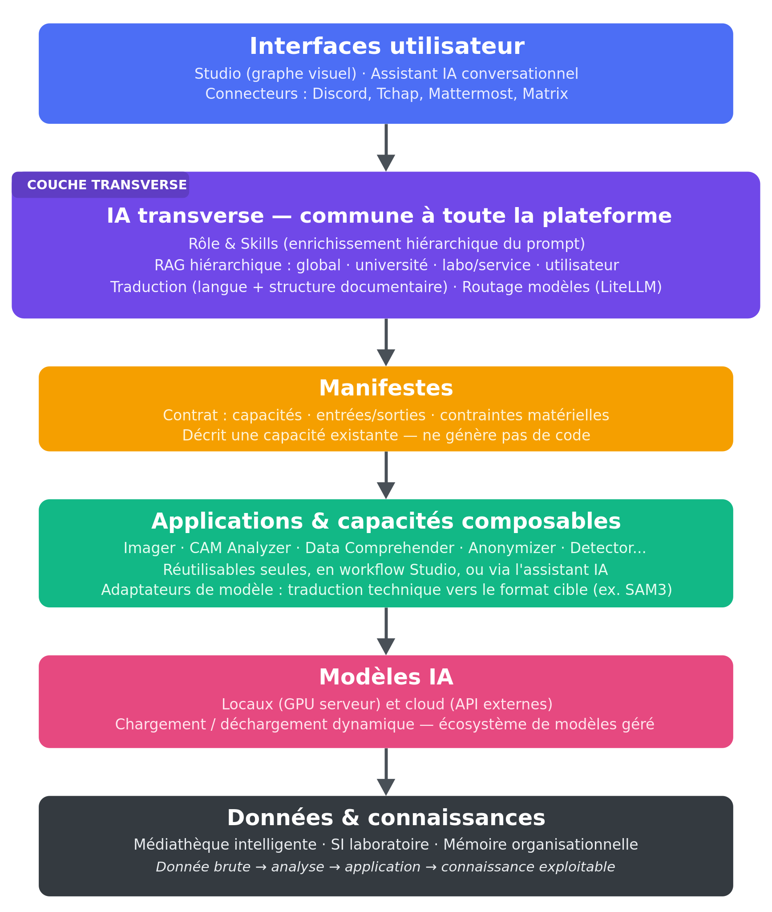
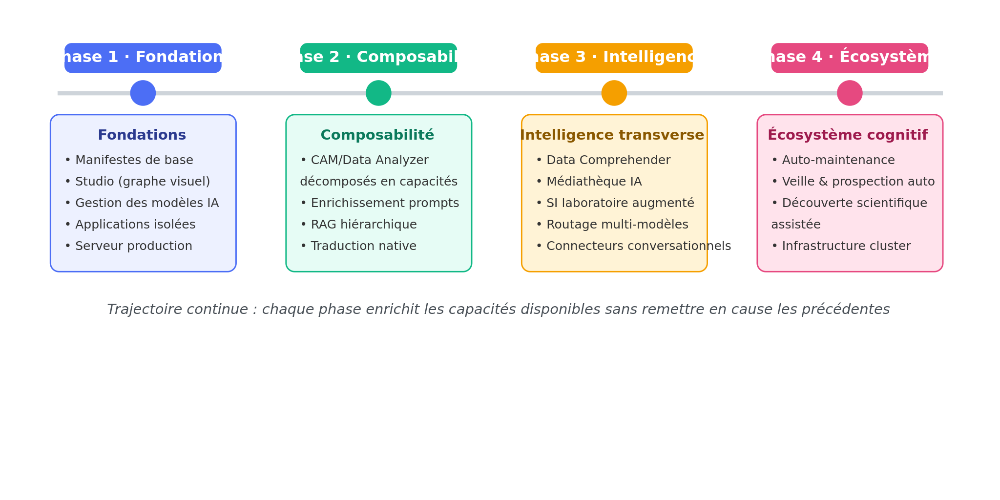

# WAMA

### Vision, architecture et trajectoire d'évolution

*Plateforme IA multimodale pour la recherche, l'industrie, l'enseignement et la création*

**Document de vision stratégique — version complète**

Juillet 2026

---

# Sommaire

**Résumé exécutif**

**Partie I — Vision et philosophie**

  - 1. Vision générale
  - 2. Une philosophie différente de la génération automatique de code

**Partie II — Architecture fondatrice : les manifestes**

  - 3. Le manifeste comme contrat
  - 4. Auto-instanciation d'applications
  - 5. Gestion intelligente des modèles IA

**Partie III — Le Studio et l'orchestration**

  - 6. Le Studio WAMA
  - 7. Le graphe de capacités
  - 8. Typage des données

**Partie IV — IA transverse : rôle, skills, RAG, traduction et routage**

  - 9. Rôle et Skills : deux niveaux d'enrichissement distincts
  - 10. Enrichissement hiérarchique des prompts
  - 11. RAG hiérarchique
  - 12. Traduction linguistique native entrée/sortie
  - 13. Traduction consciente de la structure documentaire
  - 14. Adaptateurs de modèle : traduction technique de format
  - 15. Chaîne unifiée : du prompt utilisateur au modèle
  - 16. L'assistant IA comme interface de l'écosystème

**Partie V — Création multimédia**

  - 17. L'Imager : génération visuelle contrôlée
  - 18. Médiathèque créative et gestion d'actifs
  - 19. Inspiration et différence avec ComfyUI
  - 20. Vers un moteur de génération multimédia avancé
  - 21. Story Director : chaîne complète de création audiovisuelle
  - 22. Storyboard intelligent
  - 23. Génération vidéo, audio et personnages

**Partie VI — Applications scientifiques métiers : le cas CAM Analyzer**

  - 24. CAM Analyzer : exemple d'application métier augmentée
  - 25. Du CAM Analyzer vers le Studio WAMA
  - 26. Face Analyzer et analyse comportementale

**Partie VII — Comprendre les données : le Data Comprehender**

  - 27. La couche Data WAMA
  - 28. Data Comprehender : comprendre avant d'exploiter
  - 29. Compréhension multimodale des données scientifiques
  - 30. Fonctionnement du Data Comprehender
  - 31. Recherche intelligente dans les données
  - 32. Vision « DeepMind » adaptée aux laboratoires
  - 33. La boucle de découverte scientifique

**Partie VIII — Médiathèque universitaire et système d'information**

  - 34. Médiathèque universitaire intelligente
  - 35. Fonctionnement de la médiathèque WAMA
  - 36. Une médiathèque augmentée par IA
  - 37. Connexion aux applications créatives
  - 38. Système d'information laboratoire augmenté
  - 39. Assistant laboratoire et réunions basées sur les faits

**Partie IX — Opérations : batch, auto-maintenance et veille**

  - 40. Batch processing généralisé
  - 41. Auto-maintenance de WAMA
  - 42. Auto-amélioration, veille et prospection de modèles

**Partie X — Infrastructure et trajectoire**

  - 43. Infrastructure matérielle et montée en puissance
  - 44. Évolution matérielle progressive
  - 45. Trajectoire d'évolution globale
  - 46. Positionnement stratégique
  - 47. Vision finale : une infrastructure cognitive pour les laboratoires

**Partie XI — Interconnexion conversationnelle et routage intelligent des modèles**

  - 48. WAMA comme assistant intégré aux environnements de travail
  - 49. Priorité aux solutions ouvertes et maîtrisées
  - 50. Assistant IA omniprésent
  - 51. LiteLLM : couche d'abstraction et de routage des modèles
  - 52. Politique intelligente de sélection des modèles
  - 53. Vers une gouvernance intelligente des IA

**Conclusion**

# Résumé exécutif

WAMA est une plateforme IA multimodale conçue pour transformer la manière dont les modèles d'intelligence artificielle, les données et les applications métiers sont développés, intégrés et exploités.

L'objectif de WAMA n'est pas de remplacer les développeurs ou les chercheurs par une génération massive de code réalisée par des LLM. Cette approche montre rapidement ses limites lorsqu'il s'agit de construire des systèmes complexes, maintenables et cohérents.

> **Développer une fois les briques complexes, les transformer en capacités réutilisables, puis permettre leur composition intelligente dans un écosystème cohérent.**

L'arrivée massive de nouveaux modèles IA crée un paradoxe : les capacités progressent extrêmement rapidement, mais leur intégration opérationnelle reste longue et répétitive. Chaque équipe recommence souvent les mêmes tâches : installation de modèles, création d'interfaces, gestion des paramètres, préparation des données, développement de pipelines, adaptation aux formats, création d'outils spécifiques.

WAMA vise à résoudre ce problème en créant une couche d'abstraction entre les modèles IA, les applications, les données, les utilisateurs et les ressources matérielles.

> **Une donnée brute → une analyse → une application → une connaissance exploitable.**

# Partie I — Vision et philosophie

## 1. Vision générale

Les plateformes IA actuelles sont souvent organisées autour d'un modèle particulier : un LLM, un générateur d'image, un modèle de vision, un outil d'analyse.

WAMA adopte une approche différente. La valeur ne vient pas uniquement du modèle utilisé, mais de la capacité à orchestrer plusieurs modèles, plusieurs applications, plusieurs sources de données, plusieurs niveaux de connaissances et plusieurs contextes utilisateurs.

> **La vision WAMA est celle d'un écosystème cognitif local et évolutif.**

- les modèles deviennent des composants ;
- les applications deviennent des capacités ;
- les workflows deviennent des objets reproductibles ;
- les données deviennent intelligibles ;
- les connaissances deviennent accessibles.

## 2. Une philosophie différente de la génération automatique de code

L'arrivée des assistants de programmation avancés permet aujourd'hui de générer rapidement du code. Cependant, une grande partie du temps humain reste consacrée à des tâches répétitives : recréer des interfaces similaires, connecter des bibliothèques, adapter des formats, écrire des wrappers, construire des pipelines classiques.

WAMA considère que l'avenir n'est pas une génération permanente de code, mais une capitalisation intelligente du développement existant.

1. Développer une capacité complexe.
2. La documenter par un manifeste.
3. L'exposer dans l'écosystème WAMA.
4. La réutiliser dans de nouvelles applications.

Ainsi, le code devient une infrastructure stable et les applications deviennent des assemblages de capacités.

# Partie II — Architecture fondatrice : les manifestes

*Vue d'ensemble de l'architecture WAMA — de l'interface utilisateur aux données et connaissances*

## 3. Le manifeste comme contrat

Le manifeste est l'un des concepts fondamentaux de WAMA. Il ne génère pas de code : il décrit une capacité existante.

Il constitue un contrat entre une application, un modèle, des données, un utilisateur et des ressources matérielles.

### Ce que décrit un manifeste

- **Capacités** — Analyse d'image, génération vidéo, traitement audio, analyse dataframe, transcription, détection d'objets…
- **Entrées** — Image, vidéo, audio, texte, dataframe, signal, document…
- **Sorties** — Fichier, annotation, tableau, rapport, embedding, visualisation…
- **Contraintes** — Mémoire GPU nécessaire, modèles requis, dépendances, temps d'exécution…

## 4. Auto-instanciation d'applications

Le manifeste permet l'instanciation automatique d'applications généralistes. Lorsqu'un nouveau modèle de vision apparaît, WAMA peut analyser ses capacités, créer ou compléter son manifeste, l'intégrer comme nouvelle capacité, puis permettre sa combinaison avec les autres briques.

Les applications métiers complexes restent aujourd'hui développées spécifiquement. La trajectoire de WAMA est de permettre progressivement à ces applications d'exposer leurs capacités internes.

Aujourd'hui :

`CAM Analyzer  →  application complète développée en dur`

Demain :

`CAM Analyzer  →  extraction vidéo  →  détection objets  →  tracking  →  fusion capteurs  →  reconstruction 3D  →  analyse trajectoire`

Ces capacités deviennent alors utilisables par le Studio et l'assistant IA.

## 5. Gestion intelligente des modèles IA

WAMA considère les modèles comme des ressources dynamiques. La plateforme doit pouvoir gérer plusieurs modèles en parallèle, avec chargement dynamique, déchargement automatique, optimisation mémoire et choix automatique du matériel.

Ceci est particulièrement important pour un serveur de production où plusieurs applications doivent fonctionner simultanément, où les modèles peuvent être volumineux et où certaines applications nécessitent beaucoup de VRAM.

> **L'objectif n'est pas uniquement d'exécuter un modèle, mais de gérer un écosystème de modèles actifs.**

# Partie III — Le Studio et l'orchestration

## 6. Le Studio WAMA

Le Studio est l'environnement central d'orchestration. Il permet de construire des chaînes de traitement par programmation graphique, en s'inspirant de certains principes d'outils comme ComfyUI : graphes, nœuds, connexions, paramètres, workflows sauvegardables.

Mais son objectif est beaucoup plus large : là où ComfyUI orchestre principalement des pipelines de génération visuelle, WAMA orchestre l'IA, les données, les applications métiers, les traitements scientifiques, les médias et les workflows industriels.

## 7. Le graphe de capacités

Dans WAMA, un nœud n'est pas seulement un appel modèle. Il peut représenter une application complète, une analyse scientifique, un traitement data, une source de données ou une capacité multimédia.

`Vidéo caméra  →  Extraction frames  →  YOLO  →  Tracking  →  DataFrame  →  Analyse statistique  →  Rapport`

Chaque élément est un composant réutilisable.

## 8. Typage des données

WAMA possède un système de typage des entrées/sorties, incluant notamment :

- images, vidéos, audio, textes, documents ;
- DataFrames, séries temporelles ;
- signaux physiologiques, trajectoires, GPS, données capteurs ;
- embeddings.

Ce typage permet d'éviter des connexions incohérentes, de proposer automatiquement des workflows et de faciliter l'auto-composition.

# Partie IV — IA transverse : rôle, skills, RAG, traduction et routage

Une des spécificités de WAMA est de ne pas considérer un modèle IA comme un composant isolé. Un modèle n'a de valeur opérationnelle que lorsqu'il est intégré dans un environnement capable de lui fournir le bon contexte, les bonnes connaissances, les bonnes contraintes et les bonnes interfaces.

WAMA intègre donc plusieurs couches transverses destinées à rendre les modèles réellement utilisables dans un contexte professionnel ou scientifique.

## 9. Rôle et Skills : deux niveaux d'enrichissement distincts

WAMA distingue deux niveaux d'enrichissement du prompt, qui répondent à des questions différentes et ne doivent pas être confondus.

- **Rôle** — Identité macro, relativement stable. Définit qui répond : le cadre est fixé par l'instance ou le point d'entrée (assistant recherche, assistant développement, assistant laboratoire...). Un seul rôle actif à la fois.
- **Skill** — Procédure micro, dynamique et composable. Définit comment traiter la tâche précise à l'intérieur du rôle. Plusieurs skills peuvent se cumuler sur une même requête, déclenchés automatiquement selon l'intention détectée.

Cette distinction structure la hiérarchie des skills WAMA en plusieurs familles complémentaires :

- skills spécialisés modèle : adaptation au format exact requis par un modèle particulier (ex. liste d'objets pour un modèle de détection plutôt qu'une phrase libre) ;
- skills domaine : spécialisation par application et par métier (recherche, création audiovisuelle, analyse scientifique...) ;
- skills développeur / workflow : intégrés directement dans l'environnement de développement WAMA pour le développement, l'auto-maintenance, le debug, la veille technologique ;
- skills institutionnels : connaissance de l'université et des instances internes, souvent couplés au RAG organisationnel ;
- skills utilisateur : préférences et habitudes individuelles, qui s'ajoutent aux skills domaine déclenchés automatiquement.

## 10. Enrichissement hiérarchique des prompts

Au-delà de la distinction rôle / skill, WAMA organise l'enrichissement du prompt selon quatre niveaux hiérarchiques, qui peuvent se combiner :

- **Niveau global** — Règles d'utilisation, style, bonnes pratiques, contraintes communes à toute la plateforme.
- **Niveau métier / skills** — Vocabulaire métier, méthodes, objectifs, critères de qualité propres à une application ou un domaine.
- **Niveau organisationnel** — Contexte université, laboratoire, service — règles et conventions propres à l'entité.
- **Niveau utilisateur** — Préférences individuelles : habitudes, formats favoris, méthodes de travail.

Ainsi, un même modèle peut être utilisé différemment selon son contexte d'appel.

## 11. RAG hiérarchique

WAMA intègre un système de RAG à plusieurs niveaux. Contrairement à un RAG classique connecté à une seule base documentaire, WAMA organise les connaissances selon une hiérarchie de gouvernance : chaque niveau a son propriétaire et ses propres règles de mise à jour.

`Connaissances globales  →  Université  →  Laboratoire / Service  →  Utilisateur`

Cette organisation permet la personnalisation, le respect du contexte institutionnel, le partage contrôlé et la capitalisation progressive. Le RAG devient une mémoire structurée de l'organisation.

Le déclenchement du RAG n'est pas strictement subordonné à celui des skills : les deux résultent d'une même étape de classification de l'intention, menée en amont. Un skill peut orienter la sélection du niveau de RAG le plus pertinent (par exemple, un skill « méthodologie de recherche » privilégiera le RAG université), mais un besoin d'information peut aussi être détecté indépendamment de tout skill métier — une simple question factuelle sur l'organisation, par exemple.

## 12. Traduction linguistique native entrée/sortie

WAMA intègre une gestion native de la traduction afin de décorréler la langue de l'utilisateur, la langue des données et la langue du modèle. Cette approche permet l'utilisation de modèles principalement anglophones par des utilisateurs francophones, l'exploitation de documents multilingues, la collaboration internationale et l'utilisation homogène des applications.

`Utilisateur  →  Langue utilisateur  →  Traduction entrée  →  Traitement IA  →  Traduction sortie  →  Utilisateur`

Concrètement, la vérification linguistique se déroule en deux points de la chaîne, une fois le modèle cible sélectionné :

- en entrée : identification de la langue du prompt, estimation de la capacité du modèle cible à l'accepter, traduction si nécessaire, avant l'appel du modèle ;
- en sortie : identification de la langue du document produit, comparaison à la langue demandée par l'utilisateur, traduction si nécessaire, avant livraison du résultat.

La traduction devient ainsi une capacité transverse de la plateforme, et non une fonctionnalité isolée d'une seule application.

## 13. Traduction consciente de la structure documentaire

La difficulté principale d'une traduction ou d'une analyse de document n'est pas linguistique : elle est structurelle. Un document mêle du texte courant, des figures, des schémas et des images contenant elles-mêmes du texte. Traiter ce document comme un flux de texte brut fait perdre l'essentiel de sa pertinence.

Cette exigence traverse plusieurs applications WAMA. Le Describer, par exemple, doit pouvoir décrire n'importe quel support ; sa description perd en pertinence s'il n'analyse pas conjointement les figures, schémas et images du document plutôt que le seul texte. Le futur Translator devra, de la même manière, conserver toute la construction du document et ne traduire que le texte — voire vectoriser le texte intégré aux images pour le traduire également, sans casser la mise en page.

Plutôt que de dupliquer cette logique dans chaque application, WAMA s'appuie sur une brique d'infrastructure partagée : un parseur structurel de document, commun au Describer, au futur Translator et à toute application manipulant des documents composites.

`Document source  →  Parseur structurel (texte / figures / images-texte)  →  Traitement ciblé (traduction ou analyse)  →  Réassemblage — mise en page conservée`

Le texte intégré à une image (légende dans un schéma, texte dans une capture) suit un traitement spécifique : extraction par OCR, traduction, puis réinsertion — par vectorisation lorsque la fidélité visuelle doit être préservée — plutôt qu'un simple écrasement du pixel d'origine.

## 14. Adaptateurs de modèle : traduction technique de format

À ne pas confondre avec la traduction linguistique : certains modèles imposent un format de requête strict, très différent d'un prompt en langage naturel. Un modèle de segmentation comme SAM3, par exemple, nécessite une liste d'objets à détecter — pas des phrases ni des verbes. L'Imager, à l'inverse, reste beaucoup plus libre dans la construction de son prompt.

Cette adaptation n'est pas un enrichissement au sens skill ou rôle : c'est une compilation déterministe, exécutée juste avant l'appel du modèle, qui traduit une intention déjà validée par le LLM en un schéma technique précis. La séparer du raisonnement du LLM évite de polluer son contexte avec des contraintes de formatage qui n'ont pas leur place dans l'enrichissement sémantique de la requête.

## 15. Chaîne unifiée : du prompt utilisateur au modèle

L'ensemble de ces couches transverses s'articule dans une chaîne de traitement unique, du message de l'utilisateur jusqu'à l'appel du modèle :

`Prompt utilisateur  →  Rôle (contexte fixe)  →  Sélection des skills`

`Sélection des skills  →  RAG hiérarchique  →  Sélection du modèle`

`Sélection du modèle  →  Vérification / traduction linguistique  →  Adaptateur de format  →  Dispatch au modèle`

Le rôle fixe le cadre général de la conversation. Les skills s'y ajoutent dynamiquement selon l'intention détectée, en s'appuyant en parallèle sur le niveau de RAG pertinent. Une fois le contexte enrichi, la sélection du modèle s'effectue en croisant les fichiers d'entrée, l'intention et les résultats du RAG. La traduction linguistique et l'adaptateur de format n'interviennent qu'en toute fin de chaîne, juste avant l'appel technique du modèle — l'un gère la langue, l'autre le schéma de requête imposé par le modèle cible.

## 16. L'assistant IA comme interface de l'écosystème

L'assistant IA n'est pas le cœur du système : c'est une interface naturelle permettant d'exploiter les capacités existantes. Il peut comprendre une demande, rechercher les capacités disponibles, construire un workflow, sélectionner les données, lancer une analyse et interpréter les résultats.

> **« Analyse les vidéos de cette expérimentation et compare les comportements selon les conditions. »**

1. Identifier les données nécessaires.
2. Trouver l'application adaptée.
3. Construire le pipeline.
4. Lancer le traitement.
5. Produire une synthèse.

# Partie V — Création multimédia

## 17. L'Imager : génération visuelle contrôlée

L'Imager constitue une première brique majeure de génération multimédia. Il intègre déjà plusieurs concepts importants : fichiers de référence, modèles de contrôle, enrichissement automatique des prompts, mots-clés imposés par l'utilisateur, accès à une médiathèque.

L'objectif n'est pas simplement de générer une image, mais de permettre une création contrôlée et reproductible.

## 18. Médiathèque créative et gestion d'actifs

La médiathèque intégrée à l'Imager permet l'accès à des médias Creative Commons, l'ajout de médias personnels, le partage entre utilisateurs et l'enrichissement par métadonnées. Un média n'est pas seulement un fichier : il devient un objet intelligent porteur de son auteur, sa licence, son origine, ses tags, son contexte, son embedding et ses relations.

## 19. Inspiration et différence avec ComfyUI

ComfyUI est une source d'inspiration importante, principalement pour son approche en graphes : composition de pipelines complexes, connexions entre étapes, contrôles fins de génération, reproductibilité des workflows.

WAMA poursuit cependant un objectif différent. Là où ComfyUI répond à « comment contrôler finement une génération d'image ou vidéo ? », WAMA cherche à répondre à « comment orchestrer une chaîne complète allant des données jusqu'à une production ou une connaissance exploitable ? ».

## 20. Vers un moteur de génération multimédia avancé

`Prompt  →  Enrichissement  →  Références image  →  Contrôle profondeur  →  Pose  →  Modèle diffusion  →  Post-traitement`

Cette chaîne s'appuie sur des types spécifiques (image référence, masque, embedding, personnage, décor, storyboard, plan vidéo) et sur un contrôle de cohérence des personnages, du style, de l'environnement et de la continuité temporelle.

## 21. Story Director : chaîne complète de création audiovisuelle

Une évolution majeure de WAMA est la création d'un environnement de production audiovisuelle assisté par IA, qui dépasse le simple « prompt → vidéo » pour construire une véritable chaîne de production :

`Idée  →  Scénario  →  Découpage  →  Storyboard  →  Plans  →  Vidéo  →  Son  →  Montage final`

## 22. Storyboard intelligent

Le storyboard devient un objet structuré. Chaque plan contient une durée, un cadrage, un mouvement caméra, un personnage, un décor, des références visuelles et des contraintes — des éléments ensuite envoyés aux moteurs de génération.

## 23. Génération vidéo, audio et personnages

Le générateur vidéo exploite le storyboard, les images de référence, les personnages et les contraintes narratives, avec image vers vidéo, animation, génération de séquences, cohérence temporelle et traitements batch.

Le Composer permet la génération musicale, la création d'ambiances, la génération d'effets sonores et l'adaptation à une scène. Une application dédiée au mixage et au mastering IA automatisera l'analyse multipistes, l'équilibrage, la correction fréquentielle, la compression, la spatialisation et le mastering.

L'Avatarizer et le Synthétiseur complètent la chaîne avec la création de personnages animés, la synchronisation labiale, la génération de voix, l'animation faciale et l'interaction.

`Scénario  →  Storyboard  →  Image  →  Vidéo  →  Personnage animé  →  Voix  →  Son  →  Film final`

# Partie VI — Applications scientifiques métiers : le cas CAM Analyzer

Une des forces de WAMA est de ne pas opposer applications généralistes et applications spécialisées. Les applications métiers constituent au contraire des briques à forte valeur ajoutée, car elles concentrent une expertise scientifique difficilement automatisable. La trajectoire de WAMA consiste à transformer progressivement ces applications en ensembles de capacités réutilisables.

`Application métier (aujourd'hui)  →  code spécifique`

`Application métier (demain)  →  import données  →  prétraitement  →  extraction caractéristiques  →  modèles IA  →  analyse  →  visualisation  →  export résultats`

## 24. CAM Analyzer : exemple d'application métier augmentée

Le CAM Analyzer illustre cette philosophie. L'objectif est de reconstruire automatiquement l'environnement d'une navette autonome à partir de données multimodales : caméras embarquées, GPS, accélérations X/Y/Z, données véhicule, radar, lidar.

`Vidéo caméra  →  Extraction images  →  Détection objets  →  Segmentation  →  Suivi temporel  →  Fusion capteurs  →  Reconstruction environnement  →  Analyse`

Les modèles existants peuvent être réutilisés : anonymisation, détection d'objets, segmentation, modèles spécialisés.

## 25. Du CAM Analyzer vers le Studio WAMA

L'objectif n'est pas simplement de posséder une application spécialisée, mais de rendre ses capacités accessibles. Un chercheur pourrait ainsi construire dans le Studio :

`Nouvelle campagne vidéo  →  CAM Analyzer  →  Extraction événements  →  Data Analyzer  →  Visualisation  →  Rapport automatique`

Le pipeline devient reproductible : les paramètres, données et résultats sont conservés.

## 26. Face Analyzer et analyse comportementale

Le Face Analyzer suit la même logique, avec comme capacités possibles la détection de visage, le suivi, l'extraction de caractéristiques, l'analyse d'expressions, les statistiques et les corrélations comportementales.

`Vidéo expérimentale  →  Analyse visage  →  Variables comportementales  →  Croisement données physiologiques  →  Analyse scientifique`

# Partie VII — Comprendre les données : le Data Comprehender

## 27. La couche Data WAMA

L'un des axes majeurs d'évolution est la construction d'un écosystème Data intégré. WAMA ne doit pas seulement exploiter des modèles IA : il doit permettre de transformer les données en connaissances, via l'ingestion, la transformation, l'exploration, la visualisation, l'analyse statistique et la génération de rapports — en s'appuyant notamment sur les briques existantes développées en MATLAB et Python.

Le Data Analyzer constitue l'application généraliste correspondante : exploration de datasets, manipulation de DataFrames, statistiques, analyses temporelles, visualisations, comparaison de groupes, génération automatique de rapports — utilisable seul, dans un workflow Studio, ou depuis l'assistant IA.

## 28. Data Comprehender : comprendre avant d'exploiter

Le Data Comprehender constitue une évolution majeure de WAMA. Il ne s'agit pas simplement d'un outil d'analyse, mais d'un système capable de répondre à :

> **« Qu'est-ce que cette donnée ? Comment peut-elle être exploitée ? Quelles autres données sont pertinentes ? »**

## 29. Compréhension multimodale des données scientifiques

- **Signaux physiologiques** — EEG, fNIRS, ECG, EDA/GSR, activité musculaire, biomécanique.
- **Données comportementales** — Événements, interactions, performances, questionnaires, annotations.
- **Oculométrie** — Positions du regard, fixations, saccades, zones d'intérêt.
- **Données physiques** — Capteurs, trajectoires, GPS, inertiel, environnement.

## 30. Fonctionnement du Data Comprehender

### Identification automatique

Analyse des formats, structures, fréquences, dimensions, métadonnées et relations temporelles, pour déterminer le type probable de donnée, son organisation et les traitements pertinents.

### Indexation intelligente

Chaque donnée est enrichie de métadonnées techniques, de concepts associés, d'embeddings, de relations et de sa provenance — elle devient recherchable par son contenu et non seulement par son nom.

### Auto-labellisation

WAMA peut utiliser des modèles existants pour produire automatiquement catégories, événements, segments et annotations :

`Vidéos brutes  →  Objets détectés  →  Situations  →  Événements  →  Dataset exploitable`

## 31. Recherche intelligente dans les données

L'utilisateur ne cherche plus uniquement un fichier : il exprime une intention.

> **« Trouve les situations où la charge cognitive semble augmenter lors d'une interaction complexe. »**

1. Comprendre la question.
2. Identifier les données nécessaires.
3. Sélectionner les sources pertinentes.
4. Construire un workflow.
5. Réaliser l'analyse.

## 32. Vision « DeepMind » adaptée aux laboratoires

Une évolution long terme majeure de WAMA est d'appliquer une philosophie proche de celle des grandes plateformes de recherche IA, mais à l'échelle des laboratoires — non pas en reproduisant les milliers de GPU ou les budgets industriels, mais en reprenant la méthode : exploiter massivement les données disponibles pour faire émerger des connaissances nouvelles.

Les laboratoires accumulent vidéos, expériences, signaux, mesures, simulations, résultats intermédiaires et documents — mais une grande partie de cette richesse reste inutilisée, freinée par des formats hétérogènes, un manque d'annotation, une absence d'indexation et une difficulté de croisement.

## 33. La boucle de découverte scientifique

`Données brutes  →  Compréhension automatique  →  Structuration  →  Représentations intelligentes  →  Recherche de motifs  →  Hypothèses  →  Validation scientifique  →  Nouvelles expériences`

Une étape essentielle consiste à transformer des données différentes — vidéo, signal EEG, trajectoire, événement comportemental — en représentations comparables (embeddings, signatures temporelles, graphes de relations) reliées dans un même espace de connaissance.

Au-delà de répondre aux questions posées, WAMA peut rechercher anomalies, comportements rares, corrélations inattendues, groupes inconnus et phénomènes émergents, assistant ainsi le chercheur dans l'exploration.

# Partie VIII — Médiathèque universitaire et système d'information

## 34. Médiathèque universitaire intelligente

Une autre évolution majeure de WAMA est son interconnexion avec une médiathèque universitaire intelligente. L'objectif est double : reconstruire une infrastructure interne permettant de maîtriser totalement la gestion des ressources numériques, et transformer cette médiathèque en une base de connaissances multimédia exploitable par l'IA.

Universités et laboratoires disposent souvent de grandes quantités de ressources — photographies, vidéos, supports pédagogiques, documents scientifiques, illustrations, captations expérimentales, médias de communication — mais celles-ci restent dispersées, peu documentées, difficilement recherchables et sous-exploitées.

## 35. Fonctionnement de la médiathèque WAMA

Le laboratoire ou service dépose simplement ses ressources ; WAMA réalise ensuite automatiquement l'analyse du contenu, l'extraction des métadonnées, la génération de tags, la classification, la création d'embeddings et l'indexation sémantique.

`Dépôt fichier  →  Analyse IA  →  Métadonnées automatiques  →  Indexation  →  Recherche intelligente`

## 36. Une médiathèque augmentée par IA

Contrairement à une médiathèque classique basée sur des dossiers et des noms de fichiers, la médiathèque WAMA comprend le contenu : un utilisateur peut rechercher « toutes les vidéos montrant une interaction humain-véhicule en environnement urbain » sans connaître le nom du fichier, son emplacement ou son auteur exact. La recherche devient basée sur le sens.

## 37. Connexion aux applications créatives

La médiathèque devient également une source de création, alimentant l'Imager, le Story Director, le générateur vidéo, le Composer et l'Avatarizer — retrouvant automatiquement logos, images d'archives, vidéos existantes, musiques adaptées et éléments graphiques.

## 38. Système d'information laboratoire augmenté

En complément de la médiathèque, WAMA vise à intégrer un système d'information unifié du laboratoire, dépassant les outils traditionnels de suivi de tâches, tickets et planning, qui capturent rarement la connaissance réelle du laboratoire.

Ce système d'information rassemble projets, expérimentations, documents, résultats, compétences, historiques, décisions et comptes rendus — pour créer une mémoire collective exploitable.

## 39. Assistant laboratoire et réunions basées sur les faits

Grâce au croisement du RAG institutionnel, du Data Comprehender, de la médiathèque et du système d'information, l'assistant IA devient capable d'aider concrètement les équipes :

- « Quels projets ont déjà travaillé sur cette problématique ? »
- « Retrouve les données associées à cette expérimentation. »
- « Quels résultats avons-nous obtenus sur ce sujet ? »
- « Prépare les éléments factuels pour la réunion. »

Un problème fréquent dans les organisations scientifiques est que les réunions reposent parfois sur des souvenirs partiels, des informations dispersées ou des documents difficiles à retrouver. WAMA vise à changer cette logique : avant ou pendant une réunion, l'assistant peut fournir historique, données disponibles, résultats, décisions précédentes et documents associés.

> **La discussion devient moins basée sur la reconstruction du passé, plus basée sur l'analyse des éléments disponibles.**

# Partie IX — Opérations : batch, auto-maintenance et veille

## 40. Batch processing généralisé

Le Studio WAMA permet d'orchestrer des traitements massifs : sélection des données, choix des applications, définition des paramètres et des sorties, lancement automatique.

`1000 vidéos expérimentales  →  CAM Analyzer  →  Extraction événements  →  Data Analyzer  →  Rapport automatique`

## 41. Auto-maintenance de WAMA

Une évolution importante est la capacité de WAMA à participer à sa propre maintenance, avec tests nocturnes, validation de fonctionnalités, tests de non-régression et comparaison de performances.

`Tâche type  →  Exécution automatique  →  Analyse résultat  →  Comparaison référence  →  Rapport anomalie`

## 42. Auto-amélioration, veille et prospection de modèles

L'écosystème IA évolue extrêmement rapidement. Une plateforme durable doit pouvoir surveiller son environnement : nouveaux modèles, nouvelles bibliothèques, nouvelles architectures, nouvelles capacités.

Lorsqu'un nouveau modèle apparaît, WAMA peut analyser ses capacités, ses performances, ses besoins matériels et son intérêt pour les applications existantes. Deux cas sont alors possibles.

- **Cas 1 — Intégration directe** — Le modèle apporte une amélioration compatible. WAMA crée manifeste, configuration, tests et intégration.
- **Cas 2 — Nouvelle capacité** — Le modèle ouvre un nouveau domaine. WAMA peut proposer la création d'une nouvelle application, la définition du manifeste et son exposition dans le Studio.

# Partie X — Infrastructure et trajectoire

## 43. Infrastructure matérielle et montée en puissance

La vision WAMA nécessite une infrastructure adaptée. La priorité initiale est l'inférence en production, avec pour besoins principaux beaucoup de VRAM, la stabilité, un fonctionnement continu et la capacité à charger plusieurs modèles.

## 44. Évolution matérielle progressive

### Étape 1 : serveur production polyvalent

Applications WAMA, modèles spécialisés, génération multimédia, traitement batch.

### Étape 2 : plusieurs serveurs spécialisés

Répartition par domaine : IA générative, vision, data, stockage.

### Étape 3 : cluster

Pour les gros volumes de données, l'entraînement spécialisé et l'apprentissage continu.

## 45. Trajectoire d'évolution globale

*Trajectoire WAMA en quatre phases cumulatives*

## 46. Positionnement stratégique

WAMA ne se positionne pas comme un simple catalogue d'applications IA. Sa valeur principale réside dans l'intégration cohérente de plusieurs couches :

`Modèles IA  →  Capacités  →  Applications  →  Studio  →  Données  →  Connaissances  →  Découverte scientifique`

## 47. Vision finale : une infrastructure cognitive pour les laboratoires

À long terme, WAMA ambitionne de devenir une infrastructure cognitive permettant aux organisations de mieux exploiter leur patrimoine numérique — une plateforme où les modèles deviennent interchangeables, les applications composables, les données compréhensibles, les connaissances accessibles, et où l'IA devient un partenaire d'exploration.

> **La finalité n'est pas uniquement d'automatiser des tâches ; elle est de permettre une nouvelle manière de travailler : plus rapide, plus collaborative, plus reproductible, davantage guidée par les données.**

# Partie XI — Interconnexion conversationnelle et routage intelligent des modèles

## 48. WAMA comme assistant intégré aux environnements de travail

L'objectif de WAMA n'est pas de créer un nouvel outil isolé nécessitant une adoption supplémentaire. Une plateforme IA réellement efficace doit pouvoir s'intégrer dans les environnements de travail existants, via des connecteurs vers différents canaux conversationnels : messageries collaboratives, outils institutionnels, plateformes de discussion, interfaces mobiles, assistants intégrés — par exemple Discord, Tchap, Mattermost, Matrix, ou toute autre plateforme compatible API.

## 49. Priorité aux solutions ouvertes et maîtrisées

Dans un contexte scientifique, institutionnel ou industriel, la circulation des informations est un enjeu majeur. L'utilisation systématique de services cloud externes peut poser des problèmes de confidentialité, de souveraineté numérique, de contraintes réglementaires, de dépendance fournisseur et de transfert d'informations sensibles.

La philosophie WAMA privilégie donc une architecture permettant l'hébergement local, le déploiement sur infrastructure maîtrisée, le contrôle des données et le choix du niveau de confidentialité.

`Utilisateur  →  Canal conversationnel  →  Serveur WAMA local  →  Assistant IA  →  Données / modèles / applications`

Les plateformes externes peuvent rester utilisables lorsque cela est pertinent, mais elles deviennent un choix contrôlé et non une dépendance.

## 50. Assistant IA omniprésent

Grâce aux connecteurs conversationnels, l'utilisateur peut interagir avec WAMA depuis son environnement habituel :

- **Depuis une réunion** — « Retrouve les résultats de cette expérimentation. » — WAMA interroge le SI laboratoire, les documents, les données et les rapports précédents.
- **Depuis une discussion d'équipe** — « Lance l'analyse sur les nouvelles vidéos CAM Analyzer. » — WAMA identifie les données, propose le workflow, lance le batch et notifie le résultat.
- **Depuis un canal scientifique** — « Compare ces deux jeux de données EEG. » — WAMA sélectionne le Data Analyzer, applique les traitements et génère une synthèse.

## 51. LiteLLM : couche d'abstraction et de routage des modèles

WAMA doit pouvoir exploiter différents types de modèles selon les besoins, les contraintes, les performances attendues, la confidentialité et les ressources disponibles. Une couche de routage telle que LiteLLM constitue une brique intéressante, créant une interface homogène entre modèles locaux, modèles cloud et modèles spécialisés.

`Application WAMA  →  Routeur IA  →  Modèles locaux (GPU serveur) / Modèles cloud (API externes)`

L'utilisateur ou l'administrateur peut définir une priorité au local, à la performance, au coût ou à la confidentialité.

## 52. Politique intelligente de sélection des modèles

- **Données sensibles** — Données laboratoire confidentielles → modèle local uniquement.
- **Tâche complexe ponctuelle** — Demande complexe → modèle cloud haut niveau, si le contexte l'autorise.
- **Traitement massif** — Batch important → modèle local optimisé pour le volume.

## 53. Vers une gouvernance intelligente des IA

Cette couche permet de dépasser la simple utilisation d'un modèle unique : WAMA devient capable de gérer un véritable écosystème IA (plusieurs LLM, modèles vision, audio, scientifiques, spécialisés métier), chaque application pouvant déclarer ses besoins, son niveau de confidentialité, ses contraintes et ses préférences de modèle.

> **Les utilisateurs ne doivent pas avoir à savoir quel modèle est utilisé, où il tourne, ni comment il est appelé. Ils expriment un besoin ; WAMA orchestre le contexte, les données, les applications, les modèles et les ressources.**

# Conclusion

WAMA propose une vision d'un environnement IA complet, local, ouvert et évolutif. Son ambition est de construire un pont entre l'intelligence artificielle, les données scientifiques, la création multimédia, les systèmes d'information et les connaissances humaines.

En s'appuyant sur les manifestes, le Studio, les applications métiers, le Data Comprehender, la mémoire organisationnelle et l'assistant IA, WAMA vise à transformer des masses de données aujourd'hui difficiles à exploiter en ressources actives capables d'assister les chercheurs, les ingénieurs, les créateurs et les institutions.

À l'échelle d'un laboratoire ou d'une université, WAMA cherche à appliquer une philosophie proche des grands centres de recherche IA :

> **Organiser les données, comprendre les informations, découvrir des connaissances et accélérer l'innovation.**